# DOSW-Library - Sistema de Gestión de Biblioteca

Sistema REST completo para la gestión de una biblioteca con operaciones de usuarios, libros y préstamos. Implementado con **Spring Boot 4.0.3**, **Java 21**, y **JUnit 5**.

## Tabla de Contenidos

- [Descripción General](#descripción-general)
- [Reglas de Negocio](#reglas-de-negocio)
- [Diagramas](#diagramas)
- [Swagger/OpenAPI](#swaggeropenapi)
- [Evidencia de Pruebas y Análisis](#evidencia-de-pruebas-y-análisis)
- [Video Demo](#video-demo)

---

## Descripción General

DOSW-Library es un sistema de gestión de biblioteca que permite:

- **Gestión de Usuarios**: Crear, consultar y administrar usuarios de la biblioteca
- **Gestión de Libros**: Registrar libros con seguimiento de copias disponibles
- **Sistema de Préstamos**: Controlar préstamos activos, devueltas y préstamos vencidos

El sistema implementa validaciones exhaustivas, manejo de errores estructurado y análisis de cobertura de código.

---


## Reglas de Negocio

### Usuarios
- ✅ Cada usuario tiene nombre único (case-insensitive)
- 🟥 No se puede eliminar usuario si tiene préstamos activos

### Libros
- ✅ Título único (case-insensitive, trimmed)
- ✅ Copias disponibles nunca negativas
- ✅ No se elimina el libro, solo se actualizan copias

### Préstamos
- ✅ **Máximo 3 préstamos activos por usuario**
- ✅ Fecha de retorno debe ser hoy o futura
- ✅ Préstamo solo si hay copias disponibles
- ✅ Estados: ACTIVE (creado) o RETURNED (devuelto)
- ✅ Préstamo vencido = ACTIVE con return date < hoy

---

## Diagramas

### 1. Diagrama General de Componentes

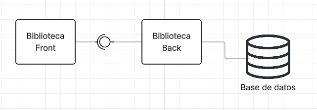

**Componentes**:
- **Controllers** (REST layer): Endpoints HTTP
- **Services** (Business logic): Lógica de negocio
- **Validators** (Validation): Validación de entrada
- **Models** (Domain): Modelos de datos
- **Exceptions** (Error handling): Excepciones personalizadas

### 2. Diagrama Específico de Componentes

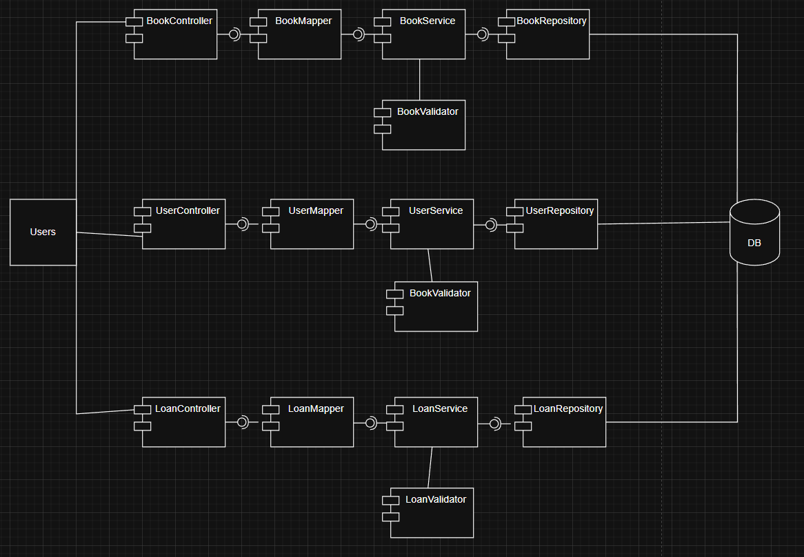

**Flujos de dependencia**:
- UserController → UserService → ValidationUtil
- BookController → BookService → BookValidator
- LoanController → LoanService → LoanValidator → UserService

### 3. Diagrama de Clases

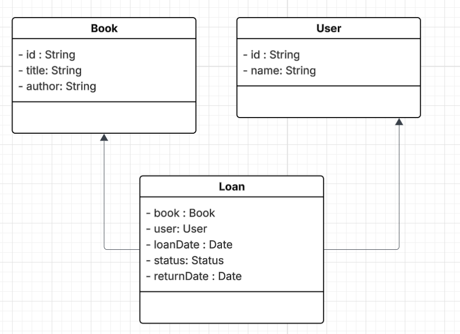

**Relaciones**:
- `User` ← `Loan` → `Book` (relación muchos a muchos)
- DTOs mapean modelos a JSON
- Excepciones heredan de `LibraryException`

### 4. Modelo de Entidad Relacion

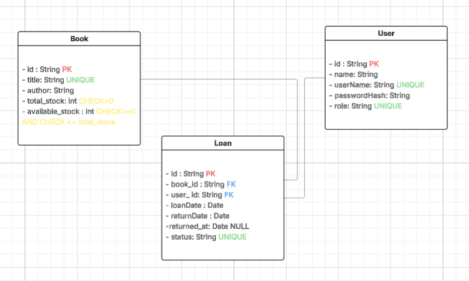

--

## Swagger/OpenAPI

Interfaz interactiva para probar endpoints:

```
http://localhost:8080/swagger-ui.html
```

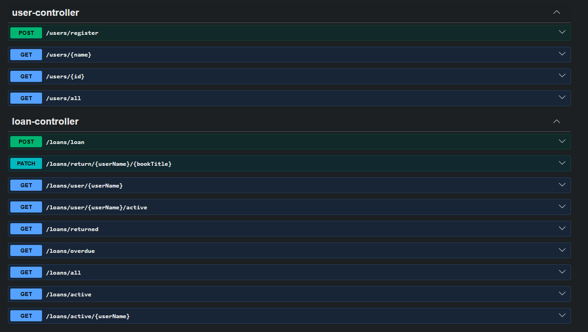
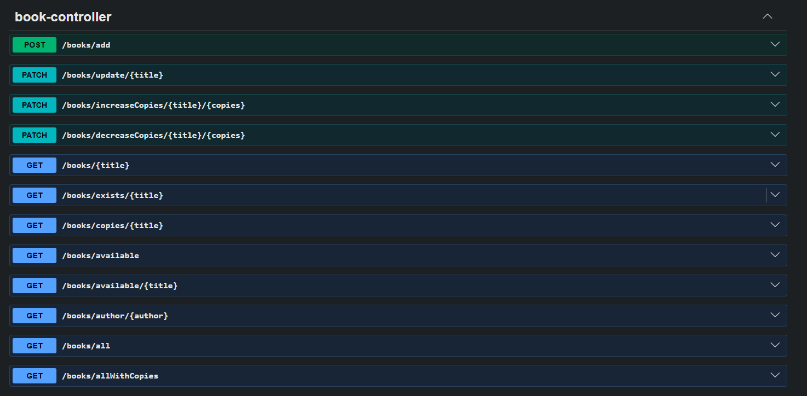

---

## Evidencia de Pruebas y Análisis

### Pruebas Servicios

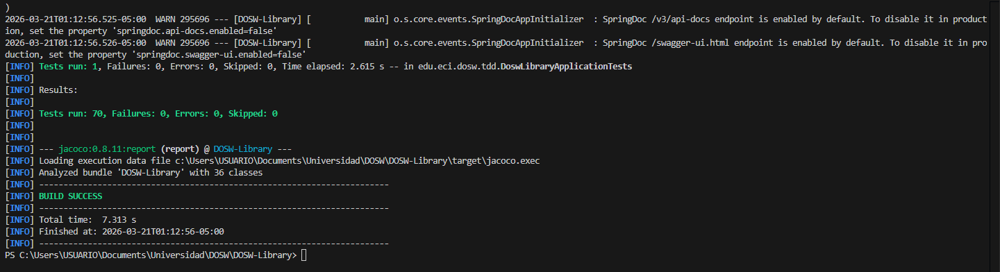

### Cobertura de Código (JaCoCo)

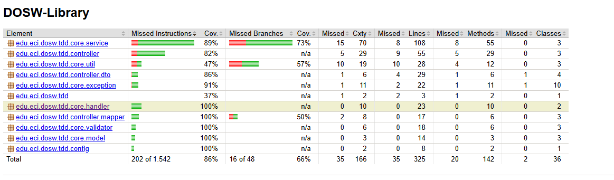


### Análisis Estático Antes

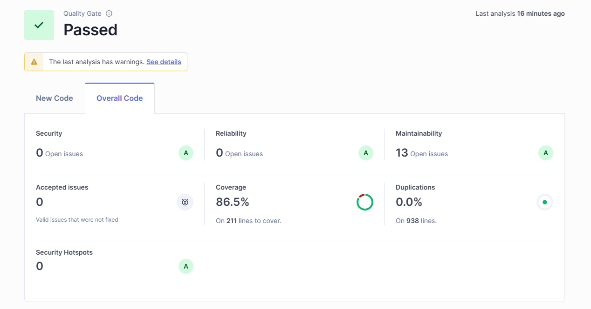


### Análisis Estático Después

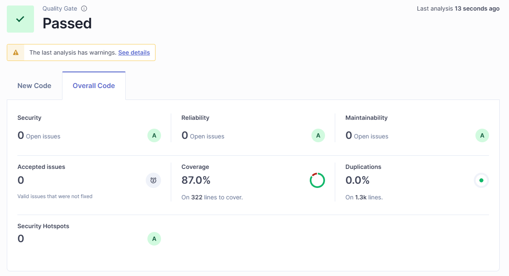


---

## Video Demo 

Video de demostración del proyecto:

[Ver video](docs/image/funcionalidades.mp4)


---

## Video Demo con persistencia

Video de demostración del proyecto:

[Ver video](docs/image/funcionalidadesPersistencia.mp4)


---

## Diagrama No relacional

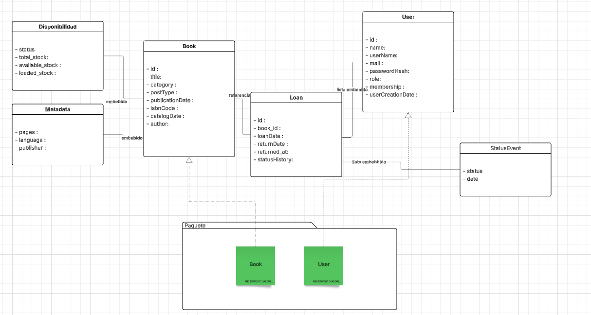
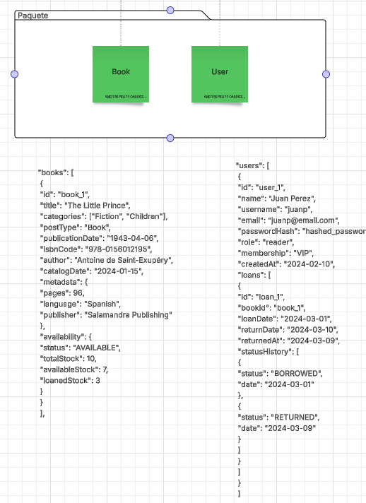


---

## Video Demo persistencia no relacional

[Ver video](docs/image/funcionalidadesPersistencia.mp4)
