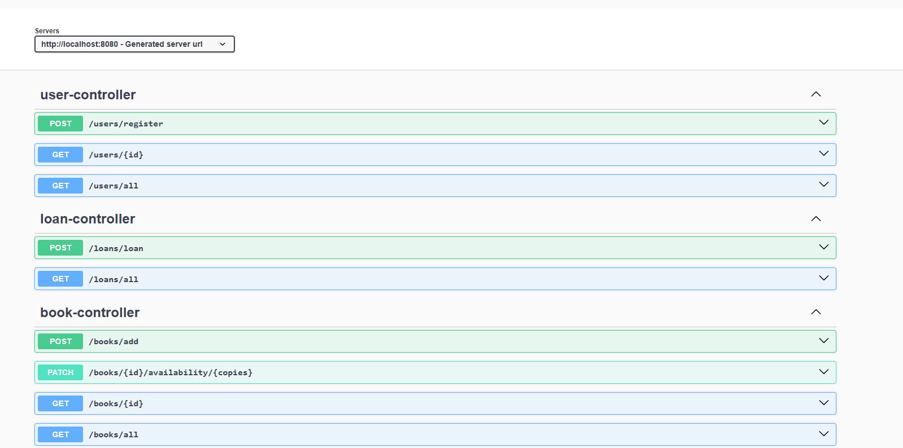

# DOSW-Library

## DIAGRAMA DE COMPONENTES NORMAL Y ESPECIFICO DE LA BIBLIOTECA

//falta especifico

## DIAGRAMA DE CLASES DE LA BIBLIOTECA

## FUNCIONALIDADES API

## PRUEBAS SERVICIOS

## Cobertura y analisis estaticp

